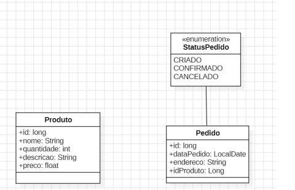
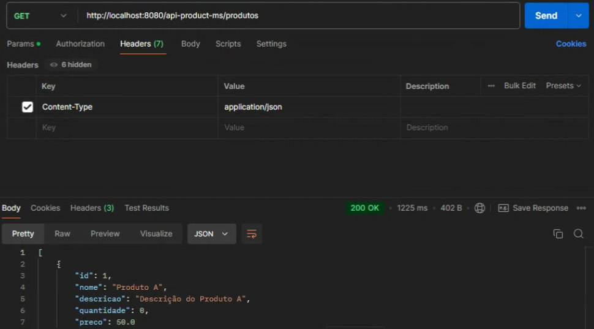
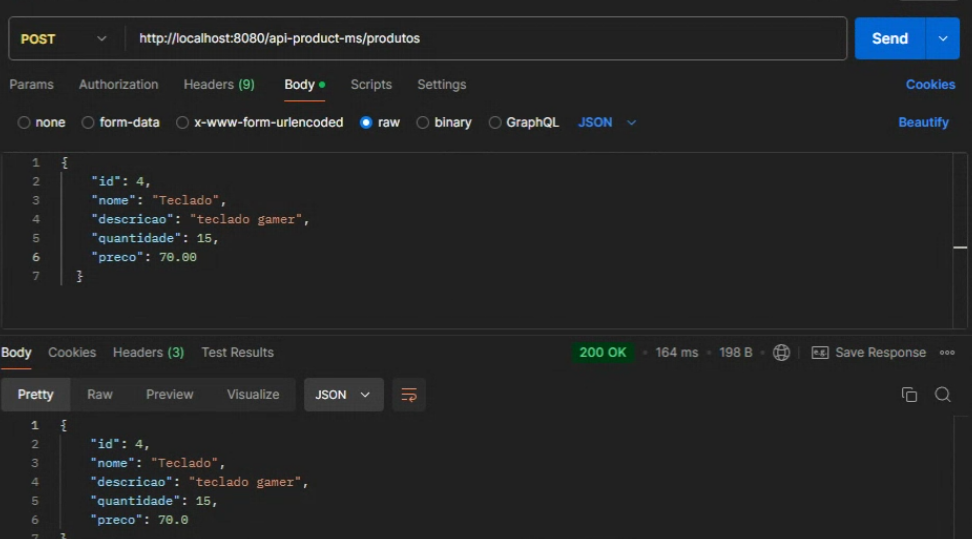
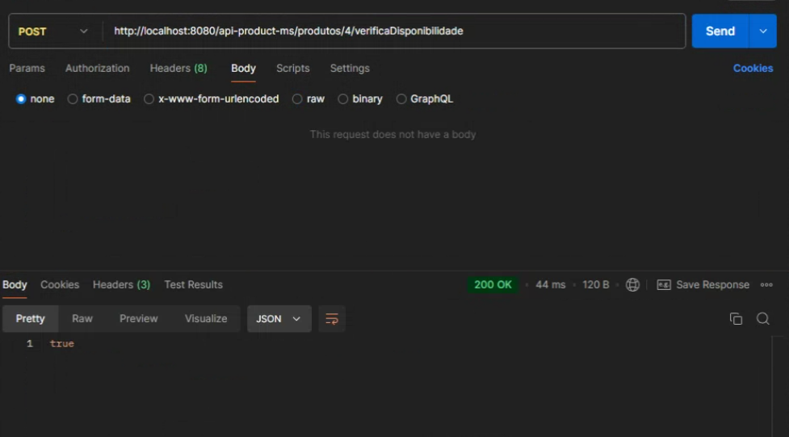
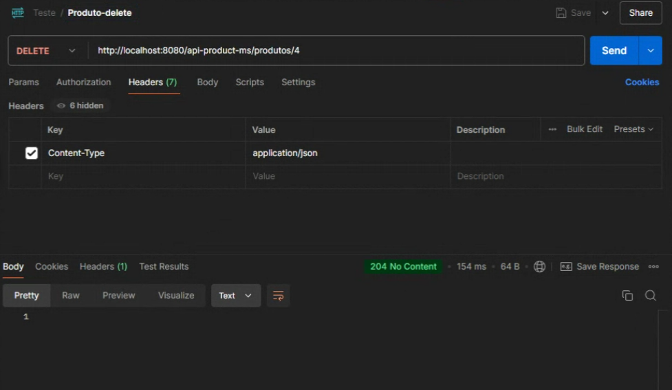
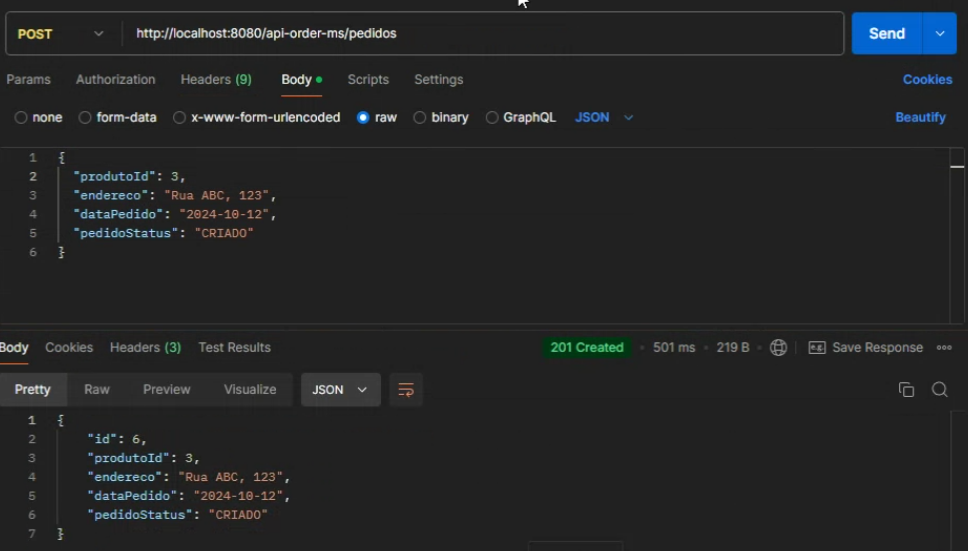
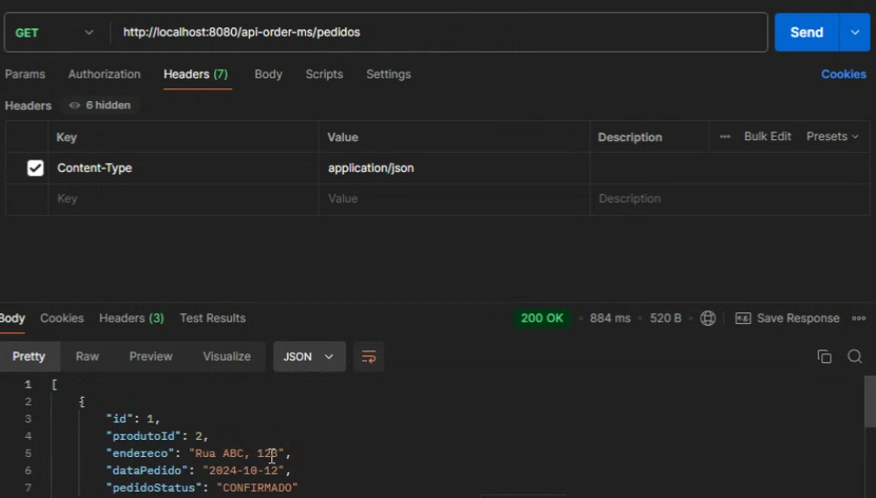
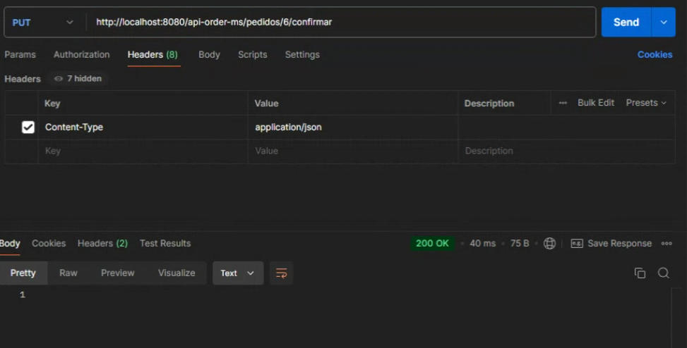
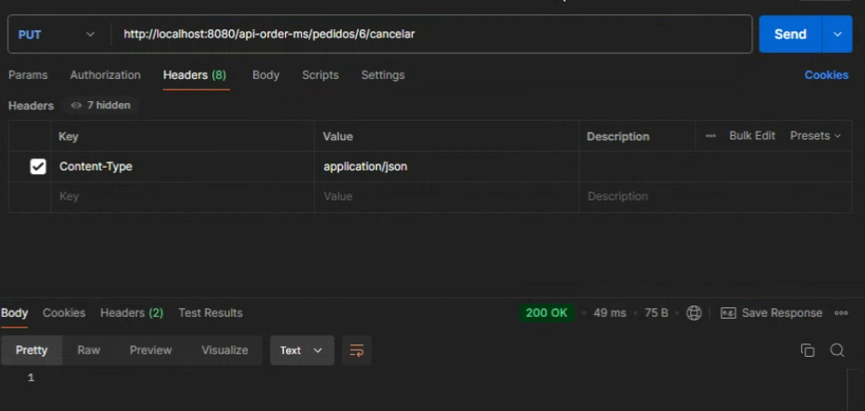
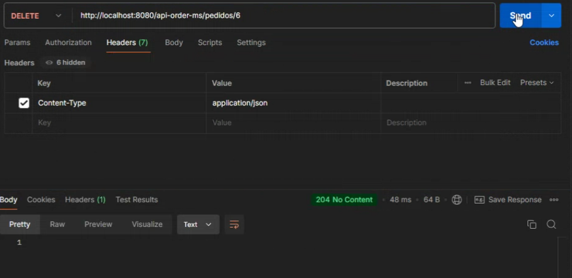

# Projeto Final - Pós-Graduação Desemvolvimento Web FullStack 
# Microsserviços API Produto e Pedido
<html>
<body>
    <header>
        <h1>Pós-Graduação: Desenvolvimento Web Fullstack</h1>
        <h2>Disciplina: API e Microsserviço</h2>
        <h3>Integrantes do Grupo:</h3>
        <ul>
            <li>Caio césar  RGM : 38091399 </li>
            <li>Vitor Cauê Guimarães Travassos  RGM:  380546621</li>
            <li>William Felix de Souza  RGM: 39699013</li>
            <li>José Felipe Alexandre Martins  RGM: 39364429</li>
        </ul>
    </header>

<section>
        <h2>API Order e Product - Microsserviços</h2>
        
Esta API é composta por dois microsserviços: o serviço de <strong>Produtos</strong> e o serviço de <strong>Pedidos</strong>. A arquitetura de microsserviços permite que cada serviço seja independente e escalável, facilitando o gerenciamento de produtos e pedidos de forma modular.

    </section>

<section>
        <h3>Diagrama de Classes</h3>
        
        
O diagrama acima ilustra a relação entre as entidades <strong>Produto</strong> e <strong>Pedido</strong>, incluindo o status enumerado de um pedido. Cada produto contém informações como nome, quantidade disponível, descrição e preço. Já cada pedido possui uma referência a um produto, data, endereço e status.

    </section>

<section>
            <h2>Endpoints do Microsserviço de Produto</h2>
            <ul>
                <li><strong>GET /produtos</strong> - Retorna a lista de todos os produtos.</li>
                <li><strong>POST /produtos</strong> - Cria um novo produto no sistema.</li>
                <li><strong>GET /produtos/{id}</strong> - Retorna os detalhes de um produto específico.</li>
                <li><strong>POST /produtos/{id}/verificaDisponibilidade</strong> - Verifica a disponibilidade do produto pelo seu ID.</li>
                <li><strong>PUT /produtos/{id}/diminuir?quantidade={numeroQueVaiDiminuir}</strong> - Diminui a quantidade de um produto específico, passando a quantidade a ser diminuída como parâmetro.</li>
                <li><strong>DELETE /produtos/{id}</strong> - Remove um produto do sistema.</li>
            </ul>
        </section>

<section>
            <h2>Endpoints do Microsserviço de Pedido</h2>
            <ul>
                <li><strong>POST /pedidos</strong> - Cria um novo pedido.</li>
                <li><strong>GET /pedidos</strong> - Retorna a lista de todos os pedidos.</li>
                <li><strong>GET /pedidos/{id}</strong> - Retorna os detalhes de um pedido específico.</li>
                <li><strong>PUT /pedidos/{id}/confirmar</strong> - Confirma um pedido, alterando seu status para <em>CONFIRMADO</em>.</li>
                <li><strong>PUT /pedidos/{id}/cancelar</strong> - Cancela um pedido, alterando seu status para <em>CANCELADO</em>.</li>
                <li><strong>DELETE /pedidos/{id}</strong> - Remove um pedido do sistema.</li>
            </ul>
    <section>
        <h2>Testes dos Endpoints usando o Postman</h2>
        
Para realizar testes na API, utilize o <strong>Postman</strong> para enviar requisições HTTP aos endpoints. Abaixo estão os endpoints com suas respectivas URLs e espaços para imagens de exemplo das requisições:

<h3>Microsserviço de Produto</h3>
        <ul>
            <li><strong>GET /produtos</strong> - Retorna a lista de todos os produtos.</li>
            
URL: <code>http://localhost:8080/api-product-ms/produtos</code>

             

 <li><strong>POST /produtos</strong> - Cria um novo produto.</li>
            
URL: <code>http://localhost:8080/api-product-ms/produtos</code>

             

 <li><strong>POST /produtos/{id}/verificaDisponibilidade</strong> - Verifica a disponibilidade do produto.</li>
            
URL: <code>http://localhost:8080/api-product-ms/produtos/4/verificaDisponibilidade</code>

            
        </ul> 
        
 <li><strong>DELETE /produtos/{id}</strong> - Deleta o produto.</li>
            
URL: <code>http://localhost:8080/api-product-ms/produtos/4</code>

            
        </ul> 

<h3>Microsserviço de Pedido</h3>
        <ul>
            <li><strong>POST /pedidos</strong> - Cria um novo pedido.</li>
            
URL: <code>http://localhost:8080/api-order-ms/pedidos</code>

             

 <li><strong>GET /pedidos</strong> - Retorna a lista de todos os pedidos.</li>
            
URL: <code>http://localhost:8080/api-order-ms/pedidos</code>

             

 <li><strong>PUT /pedidos/{id}/confirmar</strong> - Confirma um pedido.</li>
            
URL: <code>http://localhost:8080/api-order-ms/pedidos/6/confirmar</code>

             

 <li><strong>PUT /pedidos/{id}/cancelar</strong> - Cancela um pedido.</li>
            
URL: <code>http://localhost:8080/api-order-ms/pedidos/6/cancelar</code>

             

 <li><strong>DELETE /pedidos/{id}</strong> - Remove um pedido do sistema.</li>
            
URL: <code>http://localhost:8080/api-order-ms/pedidos/6</code>

             
        </ul>
    </section>
</body>
</html>
